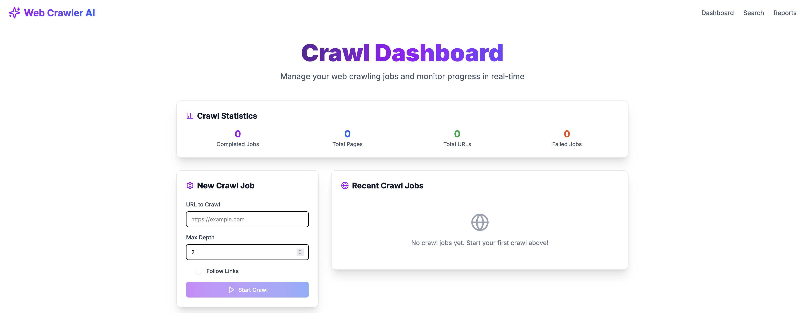
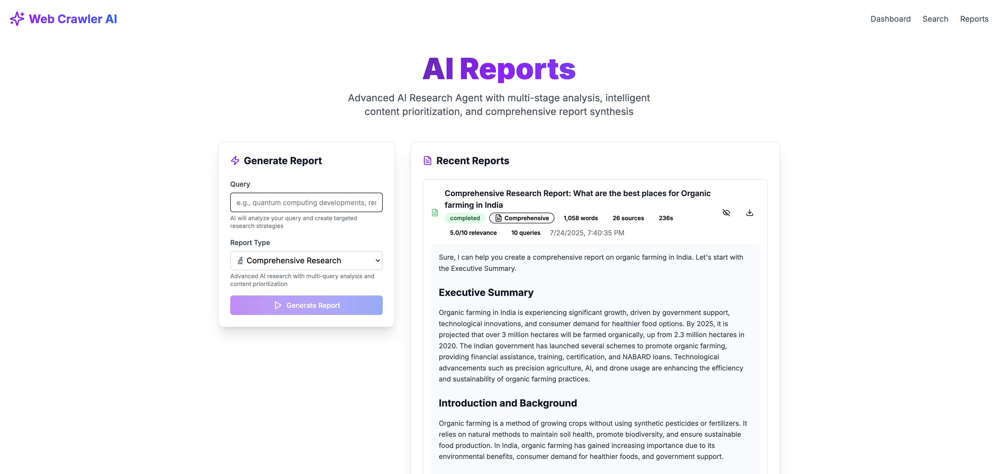
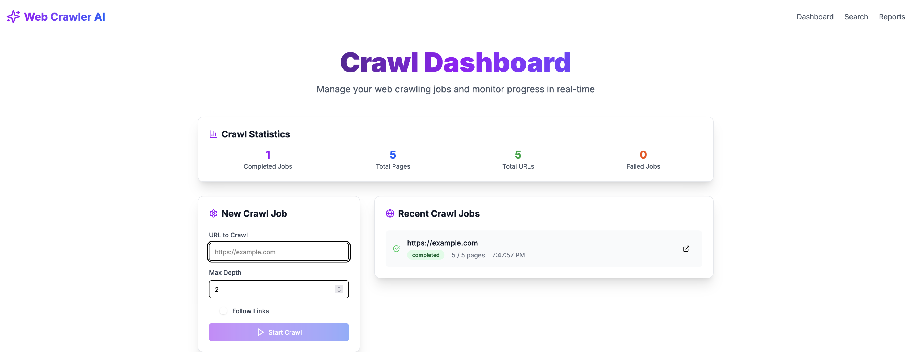

# Web Crawler AI

An intelligent web crawler and semantic search engine with advanced AI-powered reports generation. Features a sophisticated 4-stage AI research agent that conducts comprehensive web analysis and generates professional-grade reports.

## 🖼️ Screenshots

<div align="center">

### 🏠 Main Dashboard
*Beautiful, modern interface with real-time analytics and quick actions*



### 🔍 Advanced Search Interface  
*Intelligent search with AI-powered query analysis and real-time results*


### 📊 AI Reports Generation
*Comprehensive report generation with 4-stage AI analysis pipeline*



### 📈 Analytics & Statistics
*Detailed insights into crawling performance and data quality metrics*



</div>

---

## ✨ Features

### 🔬 Advanced AI Research Agent
- **4-Stage Analysis Pipeline**: Query Analysis → Multi-Query Research → Content Prioritization → Report Synthesis
- **GPT-4 Integration**: Sophisticated query analysis and content prioritization
- **Multi-Query Strategy**: 8-10 targeted search queries per research session
- **Content Extraction**: Full content analysis from 15-25 high-quality sources
- **Professional Reports**: 2000-4000 word comprehensive analysis reports

### 🚀 Core Capabilities
- **Web Crawling**: Advanced Puppeteer and Cheerio-based content extraction
- **Semantic Search**: AI-powered content analysis and search
- **REST API**: Comprehensive API for all functionality
- **Interactive Frontend**: Modern Next.js dashboard with real-time progress tracking
- **Quality Scoring**: Advanced relevance and content quality algorithms
- **Microservices Architecture**: Containerized backend and frontend services
- **Production Ready**: Docker, monitoring, logging, and health checks

## 🏗️ Project Structure
```
web-crawler-ai/
├── backend/
│   ├── app.js                      # Main entry point
│   ├── src/
│   │   ├── api/                    # Express API server
│   │   │   └── routes/             # API route handlers
│   │   │       ├── crawl.js        # Web crawling endpoints
│   │   │       ├── search.js       # Search functionality
│   │   │       ├── reports.js      # Advanced AI reports (★ Main Feature)
│   │   │       ├── stats.js        # Analytics and statistics
│   │   │       └── export.js       # Data export/import
│   │   ├── core/                   # Core crawling and extraction
│   │   ├── utils/                  # Utilities and helpers
│   │   └── nlp/                    # NLP and AI processing
│   ├── config/                     # Configuration files
│   ├── logs/                       # Application logs
│   ├── data/                       # Crawled data storage
│   ├── exports/                    # Report exports
│   └── Dockerfile                  # Backend container
├── frontend/
│   ├── src/
│   │   └── app/
│   │       ├── dashboard/          # Main dashboard
│   │       ├── search/             # Search interface
│   │       └── reports/            # Reports interface (★ Main Feature)
│   ├── components/                 # Reusable UI components
│   ├── next.config.ts             # Next.js configuration
│   └── Dockerfile                 # Frontend container
├── docker-compose.yaml            # Production deployment
├── docker-compose.dev.yaml        # Development environment
└── README.md                      # This file
```

## 🚀 Quick Start with Docker

### Prerequisites
- **Docker** (v20.0+)
- **Docker Compose** (v2.0+)
- **OpenAI API Key** (for AI-powered reports)

### 1. Clone and Setup
```bash
git clone <your-repo-url>
cd web-crawler-ai

# Create environment file
cp .env.example .env
# Add your OpenAI API key to .env:
# OPENAI_API_KEY=your_openai_api_key_here

# Optional: Use our build script for easier setup
chmod +x scripts/docker-build.sh
./scripts/docker-build.sh prod
```

### 2. 🐳 Docker Deployment (Recommended)

#### Production Deployment
```bash
# Build and start both services
docker compose up --build -d

# View logs
docker compose logs -f

# Stop services
docker compose down
```

#### Development Environment
```bash
# Start development environment with hot reload
docker compose -f docker-compose.dev.yaml up --build

# View logs
docker compose -f docker-compose.dev.yaml logs -f

# Stop development environment
docker compose -f docker-compose.dev.yaml down
```

### 3. Access the Application
- **Frontend Dashboard**: http://localhost:3001
- **Backend API**: http://localhost:3000
- **API Documentation**: http://localhost:3000/api/docs
- **Health Check**: http://localhost:3000/health

## 🔧 Manual Installation (Alternative)

### Prerequisites
- Node.js v20+
- npm v9+

### Quick Start (Recommended)
```bash
# Install dependencies for both services
npm run install:all

# Start both backend and frontend concurrently
npm run dev
# Backend runs on http://localhost:3000
# Frontend runs on http://localhost:3001
```

### Individual Service Setup

#### Backend Setup
```bash
# Navigate to backend directory
cd backend

# Install backend dependencies
npm install

# Start backend server
npm start
# Backend runs on http://localhost:3000
```

#### Frontend Setup
```bash
# Navigate to frontend directory
cd frontend

# Install frontend dependencies
npm install

# Start frontend development server (on port 3001)
npm run dev -- -p 3001
# Frontend runs on http://localhost:3001
```

## 📚 API Documentation

### 🎯 Advanced AI Reports (Main Feature)
```bash
# Generate comprehensive AI report
curl -X POST http://localhost:3000/api/v1/reports/generate \
  -H "Content-Type: application/json" \
  -d '{
    "query": "quantum computing recent developments",
    "type": "comprehensive"
  }'

# Report types available:
# - comprehensive: Multi-dimensional analysis
# - business: Business and market analysis
# - technical: Technical specifications and analysis
# - research: Academic-style research report
```

### 🔍 Core API Endpoints
- `POST /api/v1/reports/generate` - **Advanced AI Reports** (★ Main Feature)
- `POST /api/v1/search` - AI-powered search with summaries
- `POST /api/v1/crawl` - Web crawling and content extraction
- `GET /api/v1/stats` - System statistics and analytics
- `GET /health` - Service health check
- `GET /metrics` - Prometheus monitoring metrics

## 🐳 Docker Commands Reference

### Individual Service Management
```bash
# Build backend only
docker build -t web-crawler-ai-backend .

# Build frontend only
docker build -t web-crawler-ai-frontend ./frontend

# Run backend container
docker run -d --name backend \
  -p 3000:3000 \
  -e OPENAI_API_KEY=your_key_here \
  web-crawler-ai-backend

# Run frontend container
docker run -d --name frontend \
  -p 3001:3001 \
  web-crawler-ai-frontend
```

### Docker Compose Operations
```bash
# Start services in background
docker-compose up -d

# View service status
docker-compose ps

# View logs for specific service
docker-compose logs backend
docker-compose logs frontend

# Restart specific service
docker-compose restart backend

# Rebuild and restart
docker-compose up --build --force-recreate

# Scale services (if needed)
docker-compose up --scale backend=2

# Clean up everything
docker-compose down --volumes --remove-orphans
```

### Development Commands
```bash
# Start development environment
docker-compose -f docker-compose.dev.yaml up

# Rebuild development environment
docker-compose -f docker-compose.dev.yaml up --build

# Run commands inside containers
docker-compose exec backend npm run lint
docker-compose exec frontend npm run build

# Access container shell
docker-compose exec backend sh
docker-compose exec frontend sh
```

## 🔧 Configuration

### Environment Variables
Create a `.env` file in the root directory:
```env
# Required for AI Reports
OPENAI_API_KEY=your_openai_api_key_here

# Optional configurations
NODE_ENV=production
PORT=3000
NEXT_PUBLIC_API_URL=http://localhost:3000/api

# Puppeteer configuration (for Docker)
PUPPETEER_SKIP_CHROMIUM_DOWNLOAD=true
PUPPETEER_EXECUTABLE_PATH=/usr/bin/chromium-browser
```

### Docker Network
The application uses a custom Docker network `web-crawler-network` for service communication. Services communicate internally using service names:
- Backend: `http://backend:3000`
- Frontend: `http://frontend:3001`

## 🔍 Monitoring and Debugging

### Health Checks
```bash
# Check backend health
curl http://localhost:3000/health

# Check frontend health
curl http://localhost:3001

# View container health status
docker-compose ps
```


### Performance Monitoring
- **Metrics Endpoint**: http://localhost:3000/metrics (Prometheus format)
- **Resource Usage**: `docker stats`
- **Container Inspection**: `docker-compose exec backend ps aux`

## 🧪 Testing

### Development Testing
```bash
# Run tests in development environment
docker compose -f docker-compose.dev.yaml exec backend npm test
docker compose -f docker-compose.dev.yaml exec frontend npm run lint

# Run specific test suites
docker compose -f docker-compose.dev.yaml exec backend npm run test:unit
docker compose -f docker-compose.dev.yaml exec backend npm run test:integration
```

## 🚀 Advanced Features

### 📊 AI Reports System
The advanced AI reports system is the main feature of this application:

1. **Query Analysis**: AI analyzes your query to create targeted research strategies
2. **Multi-Query Research**: Executes 8-10 sophisticated search queries
3. **Content Extraction**: Extracts full content from 15-25 high-quality sources
4. **Content Prioritization**: AI scores and ranks content by relevance and quality
5. **Report Synthesis**: Generates comprehensive 2000-4000 word professional reports

### 📈 Report Types
- **Comprehensive**: Multi-dimensional analysis covering all aspects
- **Business Analysis**: Market overview, SWOT analysis, financial insights
- **Technical Analysis**: Technical specifications, architecture, performance
- **Research Report**: Academic-style analysis with literature review

## 🛠️ Development

### Local Development Setup
```bash
# Clone repository
git clone <your-repo-url>
cd web-crawler-ai

# Start development environment
docker-compose -f docker-compose.dev.yaml up

# The development environment includes:
# - Hot reload for both frontend and backend
# - Volume mounts for live code changes
# - Development dependencies installed
# - Debugging capabilities enabled
```

### Code Quality
```bash
# Lint backend code
docker compose exec backend npm run lint

# Format code
docker compose exec backend npm run format

# Run tests
docker compose exec backend npm test

# Security audit
docker compose exec backend npm audit
```

## 🛠️ Troubleshooting

### Common Docker Build Issues

#### 1. Husky/npm prepare script errors
```bash
# Error: sh: husky: not found
# Solution: Use our fixed Dockerfiles that skip scripts
docker compose build --no-cache
```

#### 2. Damaged package-lock.json
```bash
# Error: npm warn reify invalid or damaged lockfile detected
# Solution: Clean build
./scripts/docker-build.sh clean
# Or manually remove lockfiles and rebuild
rm package-lock.json frontend/package-lock.json
docker-compose build --no-cache
```

#### 3. Missing OpenAI API Key
```bash
# Error: OpenAI API key not configured
# Solution: Add key to .env file
echo "OPENAI_API_KEY=your_actual_key_here" >> .env
docker-compose restart backend
```

#### 4. Port conflicts
```bash
# Error: Port already in use
# Solution: Stop conflicting services or change ports
docker-compose down
# Kill any processes using ports 3000/3001
lsof -ti:3000 | xargs kill -9
lsof -ti:3001 | xargs kill -9
docker-compose up
```

#### 5. Container health check failures
```bash
# Check container status
docker-compose ps

# View detailed logs
docker-compose logs backend
docker-compose logs frontend

# Manual health checks
docker-compose exec backend curl -f http://localhost:3000/health
docker-compose exec frontend curl -f http://localhost:3001/
```

### Quick Fixes
```bash
# Complete cleanup and rebuild
docker-compose down --volumes --remove-orphans
docker system prune -af
./scripts/docker-build.sh clean

# Reset to clean state
git clean -fdx
cp .env.example .env
# Add your OPENAI_API_KEY to .env
docker-compose up --build
```

### Getting Help
If issues persist:
1. Check the logs: `docker-compose logs -f`
2. Verify .env file has correct OPENAI_API_KEY
3. Ensure Docker and Docker Compose are up to date
4. Try the clean build script: `./scripts/docker-build.sh clean`

## Contributing
Pull requests welcome! Please open issues for bugs or feature requests.
